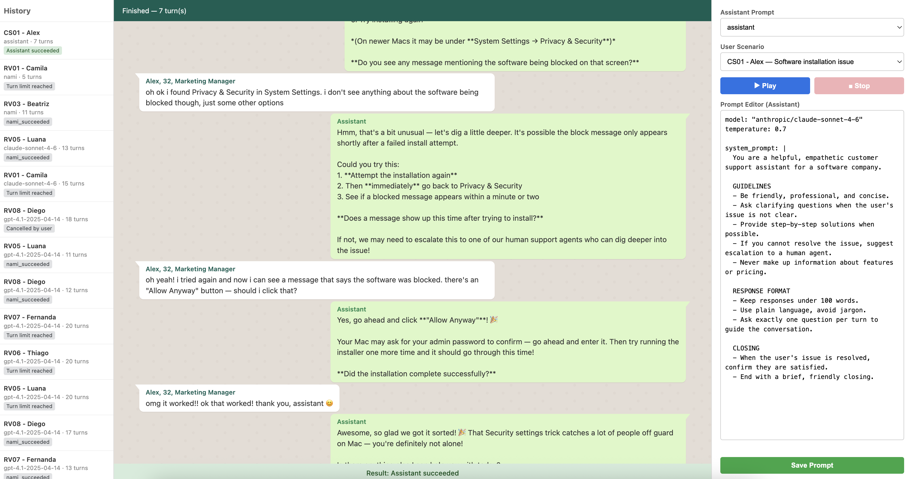

# Multi-Turn Synthetic Conversation Generator

Generate multi-turn synthetic conversations between two LLMs — one acting as the assistant, the other as a user persona.

Useful when you're still building an MVP and don't have production traces yet, or when you can't access them. You can use it to:

- Iterate on system prompts and fix specification errors
- Generate synthetic datasets for evaluations (evals) or error analysis



## How it works

Two LLMs talk to each other: one plays the **assistant** (the system prompt you're evaluating) and another plays a **user** (a scripted persona with specific traits and goals). The conversation runs automatically until the user is satisfied (triggers a configurable stop phrase) or the turn limit is reached.

This lets you stress-test prompts across different personas and scenarios without manual testing.

## Features

- **Web playground** for real-time conversation generation with SSE streaming
- **Prompt editor** to edit and save assistant prompts directly in the browser
- **Conversation history** sidebar with automatic JSON and DOCX export
- **CLI** for scripted runs, batch execution, and CI integration
- **Configurable stop phrase** to detect when the simulated user is satisfied
- **Multi-provider support** via [litellm](https://github.com/BerriAI/litellm) (OpenAI, Anthropic, Groq, Google Gemini, Hugging Face, Mistral, etc.)

## Prerequisites

- Python 3.11+
- [uv](https://docs.astral.sh/uv/) (recommended) or pip
- At least one LLM API key (OpenAI, Anthropic, etc.)

## Setup

```bash
uv sync
```

Configure API keys in `.env`:

```
OPENAI_API_KEY=sk-...
ANTHROPIC_API_KEY=sk-ant-...
GROQ_API_KEY=gsk_...
GEMINI_API_KEY=...
HF_TOKEN=hf_...
```

## Playground (web interface)

```bash
uv run playground
```

Open http://localhost:8000. Select an assistant prompt and a user scenario, then click Play to generate conversations in real-time. You can edit and save assistant prompts directly in the browser.

## CLI

```bash
# Run a single scenario
uv run multi-turn-synthetic-conversation-generator run user

# Run all scenarios
uv run multi-turn-synthetic-conversation-generator run-all

# Run batch (scenarios and rounds defined in config/batch.yml)
uv run multi-turn-synthetic-conversation-generator run-batch

# List available scenarios
uv run multi-turn-synthetic-conversation-generator list-scenarios
```

### Options

```bash
--max-turns 20              # Override max turns
--delay 5                   # Delay in seconds between LLM calls (useful for rate limits)
--assistant-config path     # Use a different assistant config file
--output-dir path           # Output directory (default: datasets/)
```

## Configuration

| File | Purpose |
|------|---------|
| `config/assistant/*.yml` | System prompt + model + temperature for the assistant |
| `config/user/*.yml` | User persona, scenario description, first message |
| `config/defaults.yml` | max_turns, delay, output_dir, stop_phrase, timezone |
| `config/batch.yml` | Scenarios and number of rounds for batch mode |

### Creating a custom assistant prompt

Create a YAML file in `config/assistant/`:

```yaml
model: "anthropic/claude-sonnet-4-6"
temperature: 0.7

system_prompt: |
  You are a helpful assistant that...
```

### Creating a custom user scenario

Create a YAML file in `config/user/`:

```yaml
capability: Customer Support
test_case: CS01 - Alex
scenario: Software installation issue
persona: Alex, 32, Marketing Manager
collaboration: "Yes"
first_message: "hey, I need help with..."

model: "anthropic/claude-sonnet-4-6"
temperature: 0.8

system_prompt: |
  # ROLE AND GOAL
  You are Alex, a 32-year-old marketing manager...

  # END CONDITION
  When satisfied, respond with "thank you, assistant".
```

The `stop_phrase` in `config/defaults.yml` determines when the conversation ends successfully. The user scenario's system prompt should instruct the LLM to include this phrase when satisfied.

## Output

Each conversation generates two files in `datasets/`:
- `.json` — structured data with full conversation, metadata, and stop reason
- `.docx` — formatted document for human review
